# ArgusCore 👁️

**Real-Time Object Recognition Engine for iOS**

ArgusCore is a lightweight, powerful iOS application that uses on-device machine learning to identify objects in real-time through the camera. By leveraging Apple's native frameworks, all processing happens locally, ensuring instantaneous results, complete offline functionality, and absolute user privacy.

## 🚀 Live Demo


*(To make this section impactful, replace the placeholder image with a screen recording GIF of your app running on your iPhone. Use a tool like [Ezgif.com](https://ezgif.com) to convert your video.)*

## ✨ Core Technologies

This project was built using a modern, native iOS tech stack:

- **Swift & UIKit**: For the core application logic and native user interface.
- **Core ML**: To integrate and run the MobileNetV2 machine learning model directly on the device.
- **Vision Framework**: To manage the image processing pipeline, preparing camera frames for analysis by the Core ML model.
- **AVFoundation**: To capture and process the live video feed from the iPhone's camera.

## 🧠 Architectural Flow

The application follows a streamlined, efficient data pipeline from camera input to UI output. Each frame from the camera is processed in real-time through a series of steps managed by the ViewController.

```mermaid
graph TD
    subgraph "Input Layer"
        A[📱 iPhone Camera] --> B(AVCaptureSession)
    end
    
    subgraph "Processing Layer (ViewController)"
        B --> C{captureOutput Delegate}
        C --> D[Frame as CVPixelBuffer]
        D --> E[VNImageRequestHandler]
    end
    
    subgraph "Analysis Layer"
        E -- Feeds Pixel Buffer --> F(Core ML Model <br> MobileNetV2)
        F -- Returns Predictions --> G[Process Classifications]
    end
    
    subgraph "Output Layer"
        G -- Updates UI --> H[📊 Result UILabel]
    end
    
    style A fill:#cde4ff,stroke:#5a96ff,stroke-width:2px
    style H fill:#cde4ff,stroke:#5a96ff,stroke-width:2px
    style B fill:#f9f9f9,stroke:#333,stroke-width:2px
    style C fill:#fff2cc,stroke:#d6b656,stroke-width:2px
    style F fill:#d5e8d4,stroke:#82b366,stroke-width:2px
```



## 🌟 Key Features

- **Real-Time Classification**: Identifies objects in the camera's view on a frame-by-frame basis.
- **On-Device Processing**: All machine learning inference happens locally. No data is sent to the cloud.
- **Privacy-Focused**: The app only requires camera access and does not store or transmit any user data.
- **Offline Capable**: Works perfectly without an internet connection.
- **Efficient Performance**: Optimized to run smoothly, leveraging hardware acceleration through Apple's frameworks.

## 🛠️ Setup & Installation

To run this project yourself:

1. **Clone the repository:**
   ```bash
   git clone https://github.com/your-username/ArgusCore.git
   ```

2. **Open the project in Xcode:**
   Navigate to the cloned directory and open the `ArgusCore.xcodeproj` file.

3. **Download the Model:**
   The project uses `MobileNetV2.mlmodel`. You can download it directly from [Apple's Developer Website](https://developer.apple.com/machine-learning/models/) and drag it into the Xcode project navigator.

4. **Run the app:**
   Select a simulator or a physical device and press the "Run" button (▶️). The app will ask for camera permissions, which must be granted.

## 👨‍💻 Author

**Om Manoj Gupta**

- **Email**: gupta.om@northeastern.edu
- **LinkedIn**: [https://www.linkedin.com/in/om-manoj-gupta-428110202/](https://www.linkedin.com/in/om-gupta-428110202/)
- **GitHub**: https://github.com/omgupta-ai

## 📄 License

This project is licensed under the MIT License. See the [LICENSE](LICENSE) file for details.
